# 💰 Price Check Reflexion Agent


A robust, self-reflecting AI agent designed to independently scour the Indian retail market for the absolute best product prices. Powered by **LangGraph** for structured state-machine workflows and **Groq** for high-speed inference, this agent employs a **Reflexion Loop**. Instead of just making one search, it critically evaluates its own findings—if it doesn't find sufficient evidence, it critiques itself, refines its search strategy, and tries again.

---

## 🏛️ System Architecture

The core of the agent is a State Graph (built with LangGraph) that orchestrates various AI components. The agent operates in a cyclic loop until it achieves a "PASS" grade from its evaluator, or hits a maximum attempt threshold.

### Architecture Flow Diagram



### Component Details

1. **Clarifier Node (`clarifier_node`)**: 
   - **Role:** Input validation and disambiguation.
   - **Logic:** Checks if the user's requested product is too generic (e.g., "iPhone 15" without specifying storage size). If ambiguous, it halts the loop and generates clarifying questions for the user. If clear, it passes the state to the Actor.

2. **Actor Query Node (`actor_query_node`)**: 
   - **Role:** Search strategy formulation.
   - **Logic:** Analyzes the product name (and any past failed reflections) to generate an exact, natural-language search query designed specifically for the Tavily backend. It targets Indian retail websites explicitly.

3. **Search Node (`search_node`)**:
   - **Role:** Web Search Execution.
   - **Logic:** Calls the Tavily Search API. It sanitizes the query (removing unsupported boolean operators) and strictly filters results to Indian domains (e.g., `amazon.in`, `flipkart.com`, `croma.com`).

4. **Actor Verdict Node (`actor_verdict_node`)**:
   - **Role:** Data Extraction & Synthesis.
   - **Logic:** Parses the search results snippets provided by Tavily. It hunts specifically for INR (₹) prices, filtering out placeholders or "out of stock" mentions. It then synthesizes a `best_price` and a `price_summary`.

5. **Evaluator Node (`evaluator_node`)**:
   - **Role:** Strict Quality Assurance.
   - **Logic:** Acts as an independent judge. It verifies that at least two independent Indian sources confirm the price for the *exact* product requested (preventing "product drift" where the agent accidentally fetches prices for a "Pro" model instead of a base model). 

6. **Reflector Node (`reflector_node`)**:
   - **Role:** Critical Feedback Generation.
   - **Logic:** If the Evaluator yields a "FAIL", the Reflector reads the failure reason and past attempts. It outputs a brief critique instructing the Actor Query Node on what to do differently next time (e.g., "Use broader keywords", "Don't specify the color").

---

## 📁 Detailed Project Structure

| File / Folder | Purpose & Description |
| :--- | :--- |
| `agent.py` | Contains the core LLM logic. Houses all the node functions (`clarifier_node`, `actor_query_node`, `actor_verdict_node`, `evaluator_node`, `reflector_node`). Handles LLM retries and rate-limit backing off. |
| `graph.py` | Wires the individual nodes from `agent.py` into a cohesive LangGraph `StateGraph`, defining the conditional edges and routing logic. |
| `state.py` | Defines the `AgentState` schema using Python's `TypedDict`. This state dictionary is passed between nodes, tracking search results, attempt counters, and the reflection history. |
| `search.py` | Contains the `web_search()` function. Manages the Tavily API client, sanitizes queries, and hardcodes the list of permissible Indian e-commerce domains. |
| `config.py` | Loads environment variables using `python-dotenv`. Acts as the single source of truth for API keys, model selection, and global constants like `MAX_ATTEMPTS`. |
| `app.py` | The rich, interactive **Streamlit** frontend. It manages a UI state machine (Input -> Clarify -> Running -> Done) and streams the agent's progress in real-time using expandable cards. |
| `main.py` | The lightweight **CLI (Command Line Interface)**. Perfect for quick terminal checks or programmatic execution. Includes a colored pretty-printer for the terminal. |
| `memory.py` | A simple, session-scoped memory class to hold the reflection trail. *(Resets every session by design).* |

---

## 🛠️ Setup & Installation

### 1. Pre-requisites
- Python 3.9 or higher.
- API keys from [Groq](https://console.groq.com/) and [Tavily](https://tavily.com/).

### 2. Clone and Setup Environment
Clone the repository and set up a virtual environment to keep dependencies isolated:

```bash
git clone <your-repo-url>
cd price_check_agent

# Create virtual environment
python -m venv venv

# Activate (Windows):
.\venv\Scripts\activate
# Activate (macOS/Linux):
source venv/bin/activate
```

### 3. Install Dependencies
```bash
pip install -r requirements.txt
```

### 4. Environment Variables
Create a file named `.env` in the root directory. Add your credentials:

```env
# Required API Keys
GROQ_API_KEY=your_groq_api_key_here
TAVILY_API_KEY=your_tavily_api_key_here

# Optional Configuration
MODEL_NAME=llama-3.3-70b-versatile
MAX_ATTEMPTS=3
MAX_SEARCH_RESULTS=6
```

---

## 💻 Usage Guide

### 1. Streamlit Interactive Web UI (Recommended)
Launch the beautiful browser-based UI, which streams the agent's internal thoughts and loops in real-time.

```bash
streamlit run app.py
```
*Navigate to `http://localhost:8501` in your browser.*

### 2. Command Line Interface (CLI)
Run searches quickly straight from your terminal.

**Provide product as an argument:**
```bash
python main.py --product "boAt Rockerz 450"
```

**Interactive CLI mode:**
```bash
python main.py
# The prompt will ask: Enter product name:
```

---

## 🧪 Test Cases (Evaluating Agent Features)

Use these sample queries to test the various capabilities of the Reflexion Agent:

### 1. Clarifier & Multi-Round Logic (Vague Queries)
*   `Samsung phone` (Agent should ask for a specific model like S24 or A55)
*   `boAt earbuds` (Agent should ask for the exact Airdopes model)
*   `Kindle` (Agent should ask for Paperwhite/Oasis and storage)

### 2. Series Without Model (Single-Round Clarification)
*   `boAt Rockerz` (Agent should ask for the exact Rockerz number)
*   `iPhone` (Agent should ask for the generation and storage)
*   `AirPods` (Agent should ask for the generation)

### 3. Happy Path (Specific Products)
*   `Sony WH-1000XM5` (Specific; should pass straight through to search)
*   `Samsung Galaxy S24 Ultra 256GB` (Highly specific; should find multiple sources easily)
*   `boAt Rockerz 450` (Specific model; should pass and tests smart merging if clarified)

### 4. Reflexion Loop Stress Tests (Niche / Hard to Find)
*These products are rare on Indian e-commerce, forcing the agent to struggle, reflect, and try new search strategies over multiple attempts:*
*   `Meze Empyrean II` (Ultra high-end headphones)
*   `Fluke 87V Industrial Multimeter` (B2B industrial tech)
*   `Oura Ring Gen 3 Horizon` (No official Indian presence)
*   `Teenage Engineering OP-1 Field` (Niche synthesizer)

---

## 🔍 Example Workflow (What happens under the hood)

1. **User asks for:** `"iPad"`
2. **Clarifier steps in:** "Wait, iPad is ambiguous. Which size and connectivity?"
3. **User clarifies:** `"10.9-inch WiFi 64GB"`
4. **Attempt 1:** Actor searches for `iPad 10.9-inch WiFi 64GB price India`. 
5. **Verdict 1:** Actor finds a price on Amazon, but no second source.
6. **Evaluator:** FAILS the attempt (Rule: Needs at least 2 independent Indian sources).
7. **Reflector:** Notes the failure and tells the Actor: "Try searching specifically on Flipkart or Croma to find a secondary source."
8. **Attempt 2:** Actor searches for `Apple iPad 10.9-inch WiFi 64GB price Flipkart Croma`.
9. **Verdict 2:** Finds prices on both Flipkart and Croma.
10. **Evaluator:** PASSES the result.
11. **Output:** The absolute best price is presented to the user!
